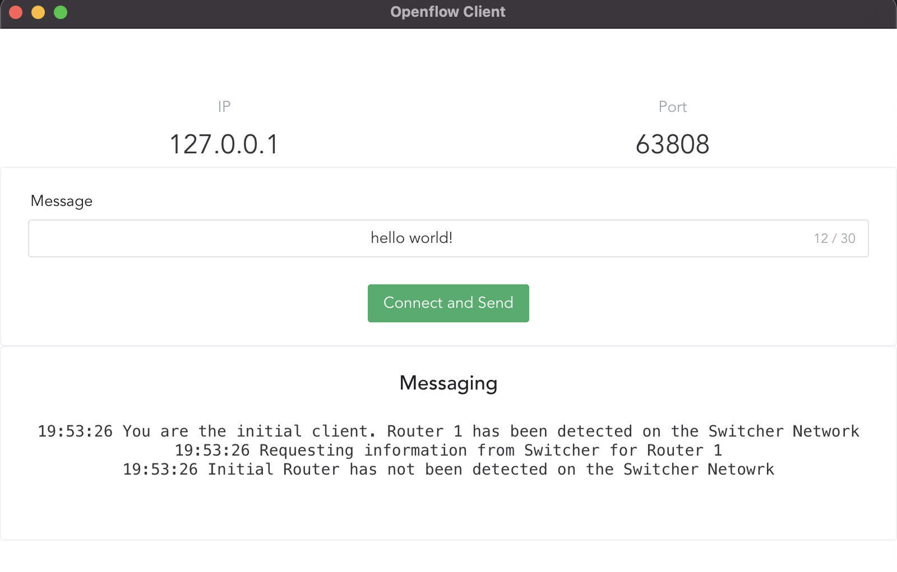
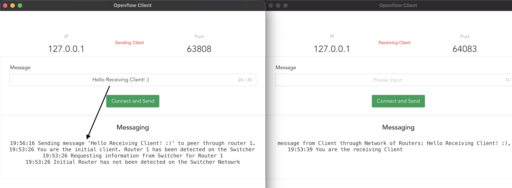

# Client ElectronJS Desktop Application
This is the [ElectronJS](https://www.electronjs.org/) Desktop Application for the Client built using [VueJS](https://vuejs.org/) and [Typescript](https://www.typescriptlang.org).

The Client uses the Node.js UDP Datagram to communicate with the Switcher and send messages across the network of Routers to another another Client.

## Installation
```bash
npm install

# Start the Electron Application
npm run electron:dev

# Build for production
npm run app:build
```
## Application

This application is started when the Client process is created. The Client attempts to connect to the Switcher and if successful, it will be allocated an IP address and port dependent on the network and available ports.

### Sending Messages
