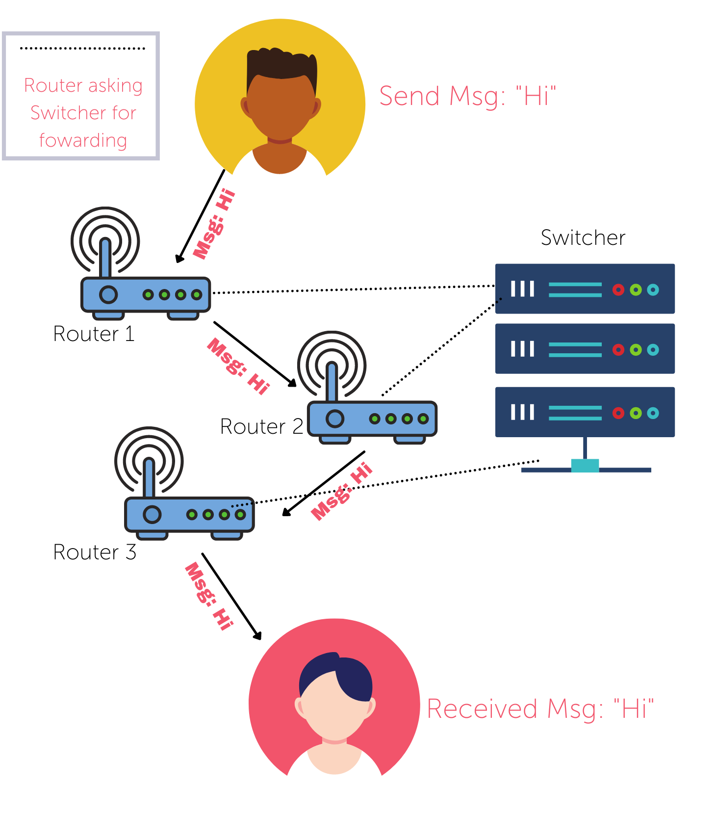

# OpenFlow UDP Socket Protocol


This project is an implementation of the [OpenFlow Protocol](https://en.wikipedia.org/wiki/OpenFlow) using the [Node.js UDP Datagram Socket Library](https://nodejs.org/api/dgram.html). The core functionality of this system provides a front-end user interface for the client which connects to the OpenFlow Network.

The OpenFlow network consists of a number of **routers** that **forward message**s and are controlled by a centralised switcher.

The switcher is a simple device that allows the routers to communicate with each other. It also allows the routers to communicate with the network.

## Project Structure
This project is divided into the following sections:
- [/Server](/Server)
  - Writen in NodeJS using the [dgram](https://nodejs.org/api/dgram.html) module to create a Switcher and a number of Routers.
- [/Client](/Client)
  - An [ElectronJS](https://www.electronjs.org/) desktop GUI application which provides a user interface that connects to the OpenFlow Network (in /Server).
  
## Downloading Repository
```
git clone https://github.com/mangledbottles/OpenFlow-Forwarding.git

cd OpenFlow-Forwarding

# See documentation inside /Client for installation of ElectronJS application
# See documentation inside /Server for installation of NodeJS Switcher and Routers
```

## Communication Protocol
Communication between the Switcher, multiple Routers and multiple Clients is handled by a universal Protocol Type system.

| Protocol Type | Description | Components [Origin -> Destination] |
| ------------- | ----------- | ---------- |
| #0 | Switcher accepted this current Router on network | Switcher -> Router |
| #1             | New Router Detected on Network by Switcher | Router -> Switcher |
| #2 | Router querying Switcher for information about Clients from Forwarding Table | Router -> Switcher |
| #3 | Client connecting to Router to get information about Forwarding Table | Client -> Router |
| #4 | Router received information about a Client from Switcher via Flowtable | Switcher -> Router |
| #5 | Router received message instructions from Client to send message over the network | Client -> Router |
| #6 | Router received updated information about current Router | Switcher -> Router |

## Project Functionality

1. Switcher is started to commence the network
2. 3 Routers are started and join the network
3. A client ("Alice") joins the network and is connected by the Switcher
4. A secondary client ("Bob") joins the network and is connected by the Switcher
5. Alice sends a message to Bob
6. The message is forwarded from Alice to Router 1 to Router 2 to Router 3 and finally to Bob.


## Wireshark
The following diagram shows the communication between the Switcher, Routers and Clients.

### Example 1: Router connecting to Network via Switcher
| No. | Time | Source | Destination | Protocol | Length | Info |
| ---- | ---- | ------ | ----------- | -------- | ----- | ---- |
| 5 | 10.382165 | 127.0.0.1 | 127.0.0.1 | UDP | 61 | 65469 -> 51510 |

| Hexadecimal Payload | Base10 Decoded |
| ------------------- | -------------- |
| 0000 0020 7b 22 74 79 70 65 22 3a 31 2c 22 6d 65 73 73 61 | {"type": 1, "messa} |
| 0010 67 65 22 3a 22 52 6f 75 74 65 72 22 7d | ge":"Router"} |

- Router on port 65469 is sending a message to the Switcher on port 51510 trying to join the network. 
- Type is set to 1, as seen in [Communication Table protocol type 1](#Communication-Protocol).

## References
- [0] OpenFlow - https://en.wikipedia.org/wiki/OpenFlow
- [1] Node Datagram Library - https://nodejs.org/api/dgram.html