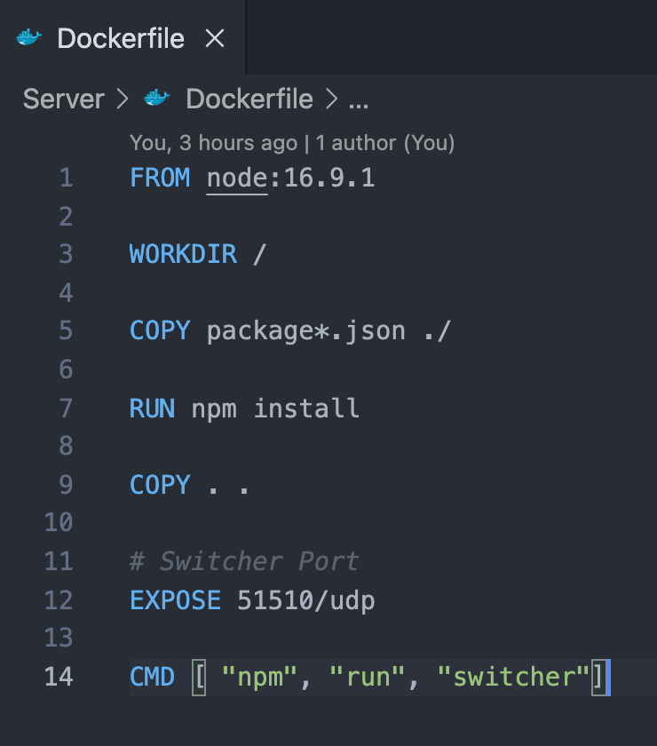

# Switcher and Router
This folder is the source code for the Switcher and Routers on the OpenFlow Protocol Network.

## Installation
```
npm install

# Start the Switcher
npm run switcher

# Start a Router (can start as many as you want)
npm run router
```

## Switcher
`./src/Switcher.ts`

The Switcher is a NodeJS application that listens on port 51510 for OpenFlow messages. The Switcher is responsible for managing the Routers and Clients.

The Switcher contains a FlowTable that is used to control the flow of traffic between Clients and Routers.
| Router | In | Out |
|--------|----|-----|
| R1 | E1 | R2 |
| R2 | R1 | R2 |
| R3 | R2 | E2 |


## Router
`./src/Router.ts`

The Router is a NodeJS application that can be started as many different processes to create multiple OpenFlow layers that connect together.

When a new Router process is created, it will send a message to the Switcher to connect and if successful, it will be added to the FlowTable.

If the Router is #1 on the network, its details will be stored and forwarded to the Client once they join the network. 

When the network is filled out with 2 other Routers and a receiving Client, the initial Client can send a message to the receiving Client and the message will be forwarded the #1 Router.

Router #1 will then forward the message to Router #2 and Router #2 will forward the message to Router #3 and Router #3 will forward the message to the receiving Client.

## Dockerising the Switcher


```
# Build the Docker image
docker build -t dermot/openflow:1.0 .

# Run the Docker image inside a container
docker run -it --rm --name openflow -p 51510:51510 dermot/openflow:1.0
```